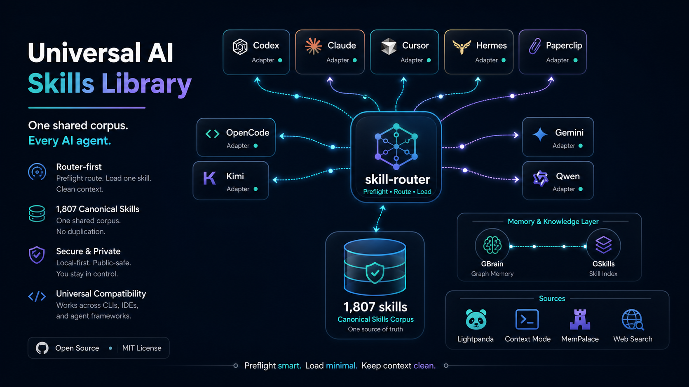

# Universal AI Skills Library

<p align="center">
  
</p>

<p align="center">
  <strong>One shared skill corpus. One router. Every AI agent.</strong>
</p>

<p align="center">
  <a href="LICENSE"></a>
  
  
  
</p>

Universal AI Skills Library is a router-first skill system for local and CLI AI
tools. It lets Codex, Claude, Cursor, Hermes, Paperclip, OpenCode, Kimi, Qwen,
Gemini, OpenHands, and other agents search, preflight-route, and load 1,812
skills on demand from one shared corpus without copying thousands of files into
every client.

The result is a clean universal skills layer for coding, research, automation,
agentic workflows, memory-aware local AI stacks, and long-running development
sessions. The full corpus stays in `skills/`; each AI client gets compact
instructions or a tiny wrapper that calls `skill-router` only when a real user
prompt needs a matching skill.

## Why It Exists

| Problem | This repo's answer |
| --- | --- |
| Every AI client wants skills in a different place. | Use compact adapters that all point back to one canonical router and corpus. |
| Large skill libraries can bloat context. | Run deterministic preflight and load exactly one relevant skill when needed. |
| Local AI stacks drift across Hermes, Paperclip, Codex, Claude, and IDE tools. | Keep portable model, memory, routing, and adapter config in repo-owned templates. |
| Public repos can accidentally leak machine state or secrets. | Ship public-safe defaults, ignored local state, validation scripts, and a release audit. |

## What It Provides

- 1,812 canonical skills in `skills/`
- `skill-router`, a Go CLI for search, preflight routing, validation, and skill loading
- compact adapters for Codex, Claude, Cursor, Gemini, OpenCode, Hermes Agent,
  Paperclip, Kiro, Qwen, Kimi, OpenHands, Cline, Continue, and similar clients
- optional Universal AI Stack runtime for model routing, health checks,
  Hermes/Paperclip integration, shared memory, local embeddings, and guarded
  local Qwen fallback
- portable source integration registry for Lightpanda, Context Mode,
  MemPalace, x-cli for X API workflows, Instagram CLI for Instagram workflows,
  Crawl4AI for local LLM-ready crawling, Firecrawl for hosted web-data API/CLI
  workflows, host-native web search, GBrain, and GSkills/GStack
- optional MCP bridge scripts for workflows that truly need persistent endpoints
- public-safe install, validation, and release-audit scripts

The normal architecture is router-first. Do not copy the full skill corpus into
every AI client.

## Quick Start

Windows:

```powershell
git clone https://github.com/onfire7777/universal-ai-skills-library.git
cd universal-ai-skills-library
.\install.ps1
```

Linux, macOS, or WSL:

```bash
git clone https://github.com/onfire7777/universal-ai-skills-library.git
cd universal-ai-skills-library
bash install.sh
```

Try it:

```powershell
skill-router --version
skill-router skill search debugging
skill-router skill universal-ai-skills
skill-router skills validate-manifest
skill-router doctor
```

Windows users who want the local Universal AI Stack to start at login can run:

```powershell
.\install.ps1 -InstallStartup -StartNow
```

To configure Kimi as the HTTP/API fallback during install:

```powershell
.\install.ps1 -KimiApiKey "<your-kimi-key>"
```

The installer writes real secrets only to:

```text
%USERPROFILE%\.universal-ai-stack\secrets\.env
```

That file is machine-local and must not be committed.

## Primary Commands

```bash
skill-router preflight --hook-event UserPromptSubmit --json "<latest user prompt>"
skill-router preflight --json "<latest user prompt>"
skill-router skill <name>
skill-router skill search <query>
skill-router route "<prompt>"
skill-router route --explain "<prompt>"
skill-router skills validate-manifest
skill-router skills sources
skill-router sync matrix
skill-router sync installed
skill-router doctor
skill-router mcp status
```

`manus` remains a legacy compatibility executable for existing local rules and
scripts. New docs and integrations should use `skill-router`.

## Automatic Skill Selection

Agent adapters should treat skill selection as an internal preflight for each
real user-submitted prompt:

1. Run `skill-router preflight --hook-event UserPromptSubmit --json "<latest user prompt>"`
   from a user-prompt hook, or `skill-router preflight --json "<latest user prompt>"`
   when the host AI performs the check directly.
2. If the decision is `route`, sanity-check that the selected skill clearly
   matches the core task, object, and action.
3. Load exactly one skill with `skill-router skill <name>` only when the route
   is clearly relevant.
4. If the decision is `ambiguous`, the host AI chooses from only the listed
   candidates or continues with no skill.
5. If the decision is `no_route`, continue normally.

Do not run automatic skill loading from tool hooks, session-start hooks, stop
hooks, compaction/resume hooks, assistant messages, tool outputs, status checks,
or background jobs.

Preflight is deterministic and does not call another LLM API. The already
running host AI supplies only the final sanity check.

## Repository Layout

```text
universal-ai-skills-library/
|-- README.md
|-- install.ps1
|-- install.sh
|-- manifest.json
|-- skill-router-cli/       # Go CLI source
|-- skills/                 # source-of-truth skill corpus
|-- ai-setup/               # portable Universal AI Stack runtime and scripts
|-- plugin/                 # plugin metadata and compact adapters
|-- infrastructure/         # optional MCP bridge and watchdog scripts
`-- docs/                   # architecture, compatibility, setup, and audits
```

## Universal AI Stack

The optional Windows stack materializes repo-owned templates into:

```text
%USERPROFILE%\.universal-ai-stack
```

It provides:

- OpenAI-compatible local router at `http://127.0.0.1:18100/v1`
- model registry and failover policy in JSON
- Kimi API fallback support
- guarded local Qwen3-Coder fallback through llama.cpp
- local Qwen embedding service for GBrain memory search
- Hermes Agent and Paperclip configuration helpers
- shared memory helpers for MemPalace plus GBrain mirror lookup
- source integration policy for Lightpanda, Context Mode, MemPalace,
  NotebookLM MCP CLI, x-cli, Instagram CLI, Crawl4AI, Firecrawl, web search,
  GBrain, and GSkills/GStack without vendoring
  those tools into the repo
- health-check and adapter-validation scripts

The default local coding fallback is:

```text
Qwen3-Coder-30B-A3B-Instruct Q4_K_M
```

It is lazy, localhost-only, one-session-by-default, below-normal priority, and
guarded so it refuses to start when free RAM or VRAM is too low.

See [Universal AI Setup](docs/UNIVERSAL_AI_SETUP.md) and
[Universal AI Connection Configs](docs/UNIVERSAL_AI_CONNECTION_CONFIGS.md) for
the full model and client integration map.

See [Source Integrations](docs/SOURCE_INTEGRATIONS.md) for the public-safe
version of the shared source layer: Lightpanda, Context Mode, MemPalace, web
search, x-cli, Instagram CLI, Crawl4AI, Firecrawl, GBrain, and GSkills/GStack.

## Compatibility Model

Compatibility is adapter-based:

- `skill-root`: clients that discover `SKILL.md` packages get a tiny wrapper
  skill and on-demand CLI loading.
- `repo-instruction`: clients that read instruction files such as `AGENTS.md`,
  `CLAUDE.md`, `GEMINI.md`, `.cursor/rules`, `.continue/rules`, or
  `.kiro/steering` get compact router instructions.
- `hosted`: hosted tools use uploaded instructions, MCP, Actions, Apps SDK, or
  API bridges instead of local full-copy sync.

The full corpus remains in `skills/` and is loaded on demand.

## Security

Public-safe defaults:

- no committed secrets
- no committed OAuth sessions or browser cookies
- local secrets generated into `%USERPROFILE%\.universal-ai-stack\secrets\.env`
- optional MCP bridges disabled unless needed
- local model servers lazy and localhost-only
- public release audit script included

Before publishing a release:

```powershell
powershell -NoProfile -ExecutionPolicy Bypass -File .\ai-setup\scripts\public-release-audit.ps1
```

See [SECURITY.md](SECURITY.md) for the reporting and secret-handling policy.

## Validation

Repository validation:

```powershell
skill-router skills validate-manifest
powershell -NoProfile -ExecutionPolicy Bypass -File .\ai-setup\scripts\validate-universal-ai-stack.ps1
powershell -NoProfile -ExecutionPolicy Bypass -File .\ai-setup\scripts\public-release-audit.ps1
```

Installed-stack validation:

```powershell
powershell -NoProfile -ExecutionPolicy Bypass -File .\ai-setup\scripts\validate-universal-ai-stack.ps1 -CheckInstalled
powershell -NoProfile -ExecutionPolicy Bypass -File "$env:USERPROFILE\.universal-ai-stack\scripts\Test-UniversalAIStack.ps1"
powershell -NoProfile -ExecutionPolicy Bypass -File "$env:USERPROFILE\.universal-ai-stack\scripts\Test-UniversalAIAdapters.ps1"
```

Go validation:

```powershell
Push-Location .\skill-router-cli
go test ./...
Pop-Location
```

## Documentation

- [Documentation Hub](docs/README.md)
- [Quickstart](docs/QUICKSTART.md)
- [Universal AI Setup](docs/UNIVERSAL_AI_SETUP.md)
- [Universal AI Connection Configs](docs/UNIVERSAL_AI_CONNECTION_CONFIGS.md)
- [Source Integrations](docs/SOURCE_INTEGRATIONS.md)
- [Architecture](docs/ARCHITECTURE_V2.md)
- [Compatibility](docs/UNIVERSAL_COMPATIBILITY.md)
- [Install Modes](docs/INSTALL_MODES.md)
- [Agent Support Matrix](docs/AGENT_SUPPORT_MATRIX.md)
- [Design and Messaging](docs/DESIGN_AND_MESSAGING.md)
- [Third-Party Source Repos](docs/THIRD_PARTY_SOURCE_REPOS.md)
- [Public Release Checklist](docs/PUBLIC_RELEASE_CHECKLIST.md)

## Contributing

See [CONTRIBUTING.md](CONTRIBUTING.md). Keep changes router-first,
portable, public-safe, and validated.

## License

MIT. See [LICENSE](LICENSE).
