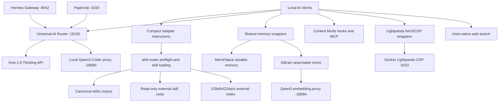

# Universal AI Connection Configs

This file is the authoritative map for the configs that make the stack universal across local AI clients. It documents what is owned by the repo, what is generated locally, and how each connection is supposed to work.

## Rule

The repo owns portable config, scripts, docs, and adapter templates. The machine owns secrets, logs, OAuth sessions, generated state, and downloaded model files.

Do not make each AI client an independent install. Each client should point back to the same router, model registry, memory wrappers, and optional tool runtimes.

## Repo-Owned Configs

| File | Role | Connected Surfaces |
| --- | --- | --- |
| `ai-setup/runtime/config/model-registry.json` | Canonical model and embedding registry. Defines `gpt-5.5`, `kimi-k2.6-thinking`, `claude-opus-4.7`, `qwen3-coder-30b-a3b-q4`, and `qwen3-embedding-0.6b-q8`. | Hermes, Paperclip, universal router, local Qwen proxy, GBrain embeddings. |
| `ai-setup/runtime/bin/local_qwen_proxy.py` | Repo-owned lazy llama.cpp proxy with RAM/VRAM guards, request-size guard, hidden backend startup, idle shutdown, and below-normal process priority. | Local Qwen coding fallback and GBrain embedding proxy. |
| `ai-setup/runtime/config/routing-policy.json` | Failover, timeouts, retry limits, circuit breaker, agent safety limits, supervisor cadence, and cost policy. | Universal router, Hermes fallback behavior, Paperclip model selection, local-model startup policy. |
| `ai-setup/runtime/config/integrations.json` | Service inventory and launch commands. Defines the universal router, Hermes gateway, Paperclip, local Qwen coding proxy, and GBrain embedding proxy. | Startup supervisor, health checks, Windows login item, local HTTP services. |
| `ai-setup/runtime/config/source-integrations.json` | Portable source registry for Lightpanda, Context Mode, MemPalace, NotebookLM MCP CLI, host-native web search, GBrain, and GSkills/GStack. | All AI adapters through compact instructions; installed stack under `%USERPROFILE%\.universal-ai-stack\config`. |
| `ai-setup/runtime/config/mcp-policy.json` | Low-resource MCP policy. Keeps persistent bridges disabled unless an endpoint workflow needs them. | MemPalace, Context Mode, Skill Seekers, Lightpanda. |
| `ai-setup/runtime/env/.env.template` | Secret names and non-secret defaults. | Central install env under `%USERPROFILE%\.universal-ai-stack\secrets\.env`. |
| `ai-setup/runtime/scripts/Install-UniversalAIAdapters.ps1` | Installs compact universal instructions and wrapper skills into supported AI roots. | Codex, Claude, Cursor, Kimi, Hermes, Paperclip, Aion, OpenCode, Continue, Kiro, Gemini, Qwen, Roo, Windsurf, Aider, OpenHands, OpenClaw, Manus-compatible roots. |
| `ai-setup/runtime/scripts/Sync-UniversalAIStack.ps1` | Applies the installed machine config: central env, Hermes/Paperclip settings, Context Mode hooks, adapter sync, and canceled-key cleanup. | Hermes, Paperclip, Kimi, Codex hooks, central secrets, local startup. |
| `ai-setup/runtime/scripts/Test-UniversalAIStack.ps1` | Runtime health check for endpoints, hidden startup, duplicate workers, secrets state, and visible-shell regressions. | Universal router, Hermes gateway, Paperclip, Qwen coding proxy, GBrain embedding proxy, Windows startup. |
| `ai-setup/runtime/scripts/Test-UniversalAIAdapters.ps1` | Adapter and config validation. Verifies every AI root has the compact universal wrapper and policy text. | All supported local AI clients. |
| `ai-setup/runtime/scripts/Test-UniversalAIContextTools.ps1` | Context Mode and Lightpanda validation. Checks hooks, matcher safety, timeouts, Lightpanda fetch, and CDP. | Codex hooks, Context Mode, Lightpanda. |
| `ai-setup/runtime/scripts/Save-UniversalAIMemory.ps1` | Explicit durable memory write path. Saves once into MemPalace, imports into GBrain, and embeds stale GBrain pages. | MemPalace, GBrain, all AI clients through shared wrapper instructions. |
| `ai-setup/runtime/scripts/Search-UniversalAIMemory.ps1` | Shared memory lookup path. Searches MemPalace first, then GBrain with fallback term search. | MemPalace, GBrain, all AI clients through shared wrapper instructions. |

## Installed Machine Configs

These are generated or updated by the installer/sync scripts. They should not be treated as repo source of truth.

| Installed Path | Purpose | Notes |
| --- | --- | --- |
| `%USERPROFILE%\.universal-ai-stack\config\agent-adapters.json` | Installed adapter inventory. | Lists instruction files and compact skill roots for every local AI client. |
| `%USERPROFILE%\.universal-ai-stack\secrets\.env` | Central secret store. | Never print or commit. Compatibility copies may be written only where a tool requires a local env key. |
| `%USERPROFILE%\.universal-ai-stack\logs\` | Runtime logs. | Logs should redact secrets and rotate. |
| `%USERPROFILE%\.universal-ai-stack\state\` | Generated health and runtime state. | Useful for diagnostics, not portable source. |
| `%USERPROFILE%\.universal-ai-stack\config\source-integrations.json` | Installed source registry. | Shared source policies for Lightpanda, Context Mode, MemPalace, NotebookLM MCP CLI, web search, GBrain, and GSkills/GStack. |
| `%USERPROFILE%\.hermes\config.yaml` | Hermes agent config. | Points Hermes at GPT-5.5 host auth plus universal router fallback and shared safety limits. |
| `%USERPROFILE%\.hermes\.env` | Hermes environment. | Contains Discord and gateway compatibility values. Real secrets stay out of git. |
| `%USERPROFILE%\.paperclip\instances\default\config.json` | Paperclip model config. | Uses OpenAI-compatible endpoint `http://127.0.0.1:18100/v1` with model `auto-coding`. |
| `%USERPROFILE%\.codex\config.toml` | Codex local config. | Registers Context Mode MCP when synced. |
| `%USERPROFILE%\.codex\hooks.json` | Codex lifecycle hooks. | Context Mode hooks only. Skill loading must not run from tool/session/stop hooks. |
| `%USERPROFILE%\.lightpanda-ai\*.cmd` and `*.ps1` | Lightpanda one-shot fetch and CDP wrappers. | On-demand browser runtime, not the Windows default browser. |
| `%USERPROFILE%\.mempalace\palace` | Durable shared memory. | Authoritative long-term memory store. |
| `%USERPROFILE%\.gbrain` and `%USERPROFILE%\gbrain` | Structured GBrain state and source. | Searchable mirror that uses the local Qwen embedding endpoint. |
| `%USERPROFILE%\.gstack\gstack` | GSkills/GStack source checkout. | Read-only external skill source; use namespaced `gstack-*` skills through `skill-router`. |
| Host web/search tool | Fresh web research. | Host-owned capability, not a repo-owned background service or committed API key. |

## Connection Graph



## Per-Client Integration Contract

Each local AI client gets the same compact policy:

1. Run `skill-router preflight --json "<latest user prompt>"` only for real user prompts.
2. Reject weak generic matches before loading a skill.
3. Load exactly one matching skill with `skill-router skill <name>`.
4. Search with `skill-router skill search <query>` when the skill name is unknown.
5. Use `Search-UniversalAIMemory.ps1` before answering from prior durable context.
6. Use `Save-UniversalAIMemory.ps1` only for explicit durable memories or confirmed project facts.
7. Keep Context Mode for context-window protection, not durable memory.
8. Keep Lightpanda on demand for browser automation and scraping.
9. Use host-native web search for fresh search when available; use Lightpanda for controlled page retrieval/extraction, not as a default search-engine proxy.
10. Load GSkills/GStack and GBrain skills through `skill-router`; do not vendor those upstream trees into client roots.
11. Use the universal router for OpenAI-compatible model fallback.
12. Do not copy the full skill corpus, MCP manifests, or secret files into the client root.

## Model Connection Rules

Host-session models:

- `gpt-5.5` and `claude-opus-4.7` are available only to hosts that can use official CLI/browser/session auth.
- They are not exposed by the HTTP router because session auth cannot be safely converted into a generic local API.

HTTP-routeable models:

- `kimi-k2.6-thinking` is the primary paid API fallback.
- `qwen3-coder-30b-a3b-q4` is the local final generative fallback.
- `qwen3-embedding-0.6b-q8` is the local embedding model for GBrain and shared memory search.
- The local llama.cpp profiles use `--n-gpu-layers 99`, 16k context for coding, 8k server context for embeddings, and one local parallel slot to keep Windows responsive. The coding proxy refuses backend startup below `20GB` free VRAM or `6GB` free RAM, rejects request bodies over `8MB`, and runs `llama-server` below-normal priority.

Paperclip and Hermes should use `auto-coding` through `http://127.0.0.1:18100/v1` when they need a generic OpenAI-compatible endpoint.

## Non-Redundancy Rules

- Keep the full 1,808-skill corpus only under `skills/`.
- Keep compact wrapper skills in AI roots.
- Keep one local generative model registered by default: `qwen3-coder-30b-a3b-q4`.
- Keep one local embedding model registered by default: `qwen3-embedding-0.6b-q8`.
- Keep MCP bridges disabled by default. Enable only when an endpoint workflow needs them.
- Keep source integrations pointer-based. Do not vendor Lightpanda, Context Mode,
  MemPalace, GBrain, or GSkills/GStack source trees into every AI root.
- Keep web search host-owned by default. Do not commit web-search provider keys
  or run a search proxy unless the user explicitly configures one.
- Keep startup hidden and supervised. Do not create visible command prompt launchers.
- Keep canceled OpenAI/OpenRouter/Anthropic/Claude API keys empty unless intentionally re-enabled.
- Keep Kimi as the paid API fallback when API usage is unavoidable.

## Health Commands

Run these after config changes:

```powershell
powershell -NoProfile -ExecutionPolicy Bypass -File .\ai-setup\scripts\validate-universal-ai-stack.ps1
powershell -NoProfile -ExecutionPolicy Bypass -File .\ai-setup\scripts\validate-universal-ai-stack.ps1 -CheckInstalled
powershell -NoProfile -ExecutionPolicy Bypass -File $env:USERPROFILE\.universal-ai-stack\scripts\Sync-UniversalAIStack.ps1
powershell -NoProfile -ExecutionPolicy Bypass -File $env:USERPROFILE\.universal-ai-stack\scripts\Test-UniversalAIStack.ps1
powershell -NoProfile -ExecutionPolicy Bypass -File $env:USERPROFILE\.universal-ai-stack\scripts\Test-UniversalAIAdapters.ps1
powershell -NoProfile -ExecutionPolicy Bypass -File $env:USERPROFILE\.universal-ai-stack\scripts\Test-UniversalAIContextTools.ps1 -Deep -StartLightpanda
skill-router skills validate-manifest
skill-router doctor
skill-router mcp status
skill-router skill search gstack
skill-router skill search gbrain
gbrain stats
mempalace status
```

Expected clean state:

- Router manifest validates with 1,808 canonical skills and no duplicates.
- All supported adapter roots contain compact universal policy.
- Hermes gateway, Paperclip, universal router, Qwen coding proxy, and GBrain embedding proxy have one worker each.
- Context Mode hooks parse without unsupported regex look-around.
- Lightpanda fetch and CDP work when Docker Linux engine is available.
- MemPalace and GBrain are both reachable.
- GSkills/GStack and GBrain source skills are discoverable through
  `skill-router` without being copied into every AI root.
- Web search remains a host-native source with no committed API key or default
  background proxy.
- Persistent MCP bridge ports can be down in the low-resource profile.

## Change Procedure

1. Edit repo-owned config or scripts first.
2. Run the repo validator.
3. Sync the installed stack.
4. Run installed-stack validators.
5. Update this document when a connection path changes.
6. Commit and push the repo.

Do not hand-edit installed machine files as the long-term fix unless the matching repo-owned config or script is also updated.
